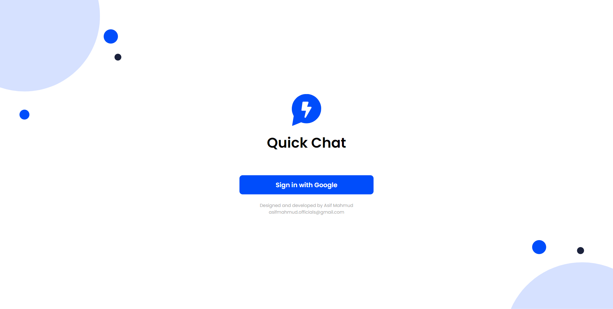
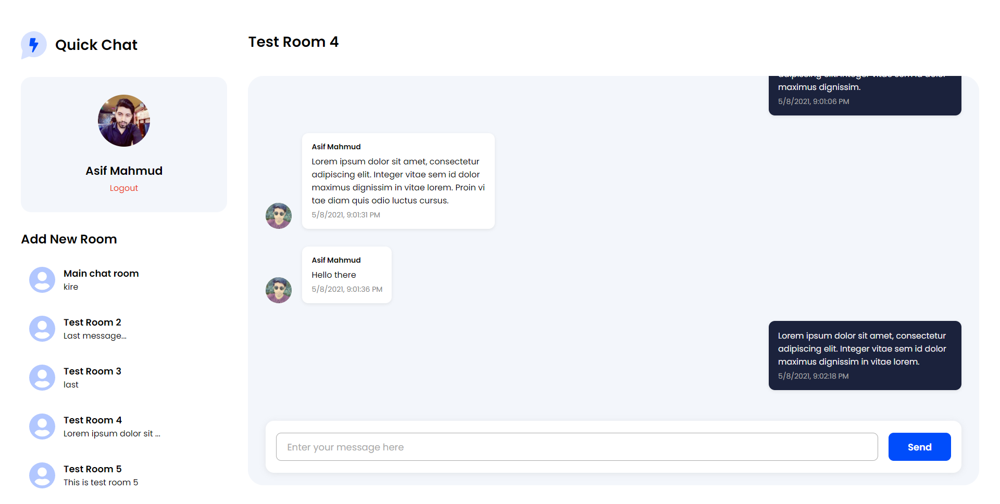
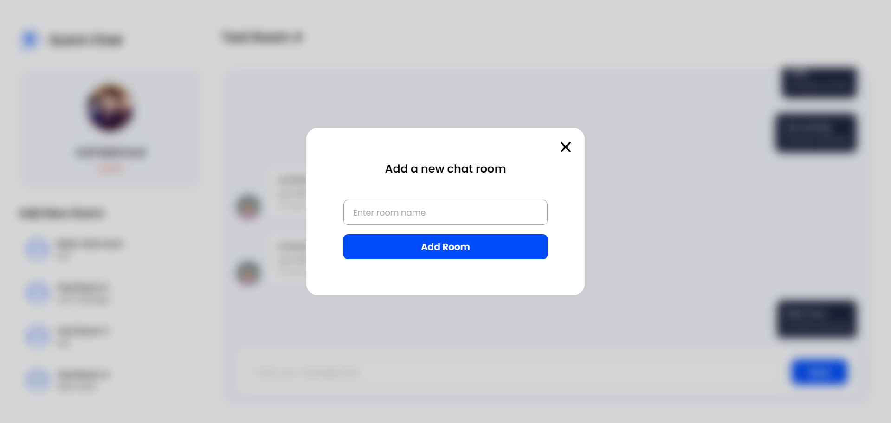
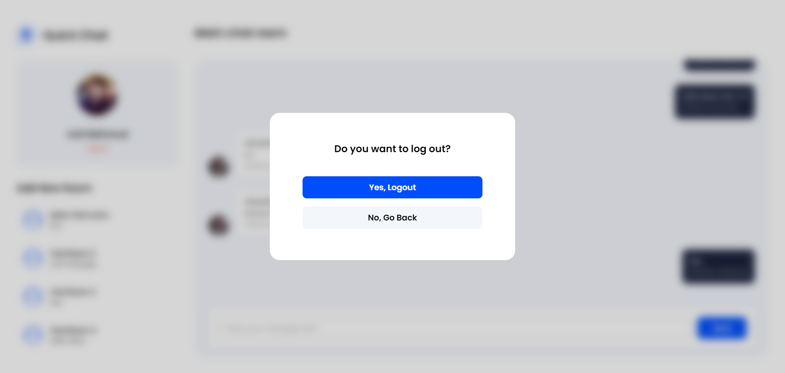

# Quick Chat

A realtime desktop chat application.

## Live App

Please checkout the live app here [Quick Chat](https://quick-chat-9ab5a.web.app/)

## App Features

- Realtime chatting
- Google Authentication
- User friendly UI
- Room based chats

## Technologies Used

- React
- Firebase
- Context API
- React Router

## Quick Start

1. Clone this git repository.

2. Run `$ npm install` in your terminal from the project directory.

3. Create a Firebase project. Enable Cloud Firestore and Google Authentication for the project. Then register a web app.

4. Create a `firebase.js` file in `src` folder and use the following code in this file using your own firebase project app config:

```
import firebase from "firebase";

const firebaseConfig = {
 //use your own firebase project app config
};

const firebaseApp = firebase.initializeApp(firebaseConfig);
const db = firebaseApp.firestore();
const auth = firebase.auth();
const provider = new firebase.auth.GoogleAuthProvider();

export { db, auth, provider };

```

5. Run `$ npm start` in your terminal to see the project in localhost.

## Screenshots

### Login Page



### Chat Page



### Add Room



### Logout


